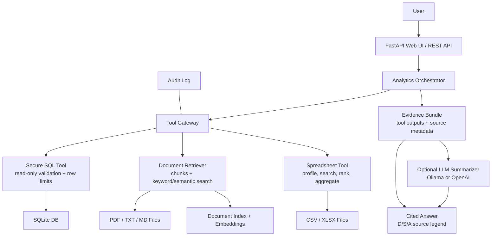

# Internal Analytics Assistant Tool Layer

This repo contains the first secure boundary for an internal AI analytics assistant. The LLM should call these tools through the gateway, never connect directly to databases, files, PDFs, or spreadsheets.

## Quick Start

1. Clone the repository:

```powershell
git clone https://github.com/FoXbat-25/Multimodal-RAG-ChatAssistant.git
cd Multimodal-RAG-ChatAssistant
```

2. Create a local environment file:

```powershell
Copy-Item .env.example .env
```

3. Start Docker Desktop.

Make sure Docker Desktop is running before starting the app.

4. Configure an LLM provider.

For free local LLM answers and semantic document retrieval, install Ollama and pull the local models:

```powershell
ollama pull llama3.2:3b
ollama pull nomic-embed-text
```

Or use OpenAI by setting these values in `.env`:

```text
LLM_PROVIDER=openai
OPENAI_API_KEY=sk-...
OPENAI_MODEL=gpt-5.4-mini
```

If neither OpenAI nor Ollama is configured, the app can still return deterministic tool-based evidence summaries, but LLM-written answers and semantic embedding retrieval will be unavailable.

5. Add your private data files:

```text
data/documents/      PDFs, TXT, and MD files
data/spreadsheets/   CSV, XLSX, and XLSM files
data/test_analytics.db
```

If your SQLite database has a different name, update `DEFAULT_SQLITE_PATH` in `.env`.

6. Build and run the app:

```powershell
docker compose up --build
```

7. Open the UI:

```text
http://127.0.0.1:8000/
```

8. Build the document index in a second terminal:

```powershell
docker compose run --rm analytics-assistant python -m analytics_assistant.cli build-doc-index
```

For a faster smoke test on large PDF folders:

```powershell
docker compose run --rm analytics-assistant python -m analytics_assistant.cli build-doc-index --max-chunks 25
```

9. Ask a question in the UI, for example:

```text
Why did the comedy movie fail?
```

## What is included

- `secure_sql_query`: read-only SQL execution against SQLite for the MVP.
- `build_document_index`: extracts `.txt`, `.md`, and `.pdf` files into a local searchable index.
- `retrieve_documents`: retrieves relevant document chunks with source metadata.
- Document ingestion manifest with file hashes, page counts, chunk counts, extraction methods, and warnings.
- `list_spreadsheets`: lists approved spreadsheet files.
- `analyze_spreadsheet`: describes or aggregates `.csv`, `.xlsx`, and `.xlsm` files.
- `assistant`: simple orchestrator that routes one natural-language question to document and spreadsheet tools.
- Optional LLM summarizer through OpenAI or local Ollama that turns retrieved evidence into a concise cited answer.
- `ToolGateway`: the single tool entry point with audit logging and provenance.

## Architecture



The LLM never reads raw databases, PDFs, or spreadsheets directly. It only receives the controlled evidence returned by backend tools.

## Data folders

Place files here:

- Documents: `data/documents/`
- Spreadsheets: `data/spreadsheets/`
- SQLite database: `data/test_analytics.db` by default

Generated files:

- Document index: `storage/document_index.json`
- Document manifest: `storage/document_manifest.json`
- Audit log: `storage/audit.jsonl`

## Environment Configuration

The app loads settings from `.env` automatically. Start from the provided example:

```powershell
Copy-Item .env.example .env
```

Useful settings:

```text
LLM_PROVIDER=ollama
OLLAMA_MODEL=llama3.2:3b
OLLAMA_EMBED_MODEL=nomic-embed-text
OLLAMA_URL=http://127.0.0.1:11434
DEFAULT_SQLITE_PATH=data/test_analytics.db
```

For OpenAI, set:

```text
LLM_PROVIDER=openai
OPENAI_API_KEY=sk-...
OPENAI_MODEL=gpt-5.4-mini
```

Keep `.env` private. Commit `.env.example` when you want to share safe defaults.

## Run from CLI

```powershell
python -m analytics_assistant.cli build-doc-index
python -m analytics_assistant.cli retrieve-docs "quarterly revenue risk"
python -m analytics_assistant.cli retrieve-docs "quarterly revenue risk" --retrieval-mode semantic
python -m analytics_assistant.cli list-sheets
python -m analytics_assistant.cli sheet sales.csv --operation describe
python -m analytics_assistant.cli sheet sales.csv --operation search --query "why comedy movie failed"
python -m analytics_assistant.cli sheet sales.csv --operation auto_profile
python -m analytics_assistant.cli sheet sales.csv --operation filter_and_rank --query "failed comedy low rating" --rank-by rating --sort-order asc
python -m analytics_assistant.cli sql "select * from revenue limit 10"
```

## Ask a Natural-Language Question

The MVP orchestrator fans out to document retrieval and spreadsheet row search, then returns an evidence-first answer with citations:

```powershell
python -m analytics_assistant.assistant "why did the comedy movie fail"
python -m analytics_assistant.assistant "why did the comedy movie fail" --json
python -m analytics_assistant.assistant "why did the comedy movie fail" --no-llm
```

By default, the orchestrator tries to use OpenAI for the final answer if `OPENAI_API_KEY` is set and the `openai` package is installed. If the key or package is missing, it falls back to the deterministic evidence summary.

```powershell
$env:OPENAI_API_KEY="sk-..."
$env:OPENAI_MODEL="gpt-5.4-mini"
python -m analytics_assistant.assistant "why did the comedy movie fail"
```

To use Ollama locally instead:

```powershell
ollama pull llama3.1:8b
$env:LLM_PROVIDER="ollama"
$env:OLLAMA_MODEL="llama3.1:8b"
python -m analytics_assistant.assistant "why did the comedy movie fail"
```

The LLM only sees the evidence returned by the backend tools. It does not connect to databases, files, PDFs, or spreadsheets directly.

Normal answers include a `Source legend` so citations are explainable:

```text
[D1] document: report.pdf, page 2
[S1] spreadsheet row: sales.csv | title=...
[A1] analysis: movies.csv | ranked by rating=3.0 | votes=1200 | title=...
```

The JSON response also includes `grounding.invalid_citations`, which flags model citations that do not map to any retrieved source.

`build-doc-index` writes a manifest so you can see whether each PDF produced useful text:

```powershell
python -m analytics_assistant.cli build-doc-index
Get-Content storage/document_manifest.json
```

If a scanned/image PDF has little extractable text, the manifest will include `low_text_extraction`. OCR fallback is supported when `pypdfium2`, `pytesseract`, and the Tesseract OCR binary are installed. If they are missing, the manifest records `ocr_fallback_unavailable_missing_*` so you know the file needs OCR setup.

For semantic retrieval, install an Ollama embedding model:

```powershell
ollama pull nomic-embed-text
$env:OLLAMA_EMBED_MODEL="nomic-embed-text"
python -m analytics_assistant.cli build-doc-index
python -m analytics_assistant.cli retrieve-docs "audience reaction and stale humor" --retrieval-mode semantic
```

If the embedding model is unavailable, indexing continues with keyword retrieval and records an embedding warning in the manifest.

For a quick semantic smoke test on large PDF folders, limit the first build:

```powershell
python -m analytics_assistant.cli build-doc-index --max-chunks 25
python -m analytics_assistant.cli retrieve-docs "audience reaction and stale humor" --retrieval-mode semantic
```

## Run as API

```powershell
pip install -r requirements.txt
uvicorn analytics_assistant.app:app --reload --port 8000
```

Example:

```powershell
Invoke-RestMethod -Method Post -Uri http://localhost:8000/tools/retrieve_documents -Body '{"query":"revenue risk","top_k":3}' -ContentType 'application/json'
```

The same FastAPI app includes a simple chat UI:

```text
http://127.0.0.1:8000/
```

On Windows, you can start it with:

```powershell
.\run_ui.ps1
```

Or double-click:

```text
run_ui.bat
```

And a natural-language endpoint:

```powershell
Invoke-RestMethod -Method Post -Uri http://127.0.0.1:8000/ask -Body '{"question":"which comedy movies failed based on low rating","use_llm":true,"top_k":5}' -ContentType 'application/json'
```

## Run with Docker

Make sure Docker Desktop is running. If you use Ollama on your Windows host, keep this in `.env`:

```text
DOCKER_OLLAMA_URL=http://host.docker.internal:11434
```

Then build and start the API/UI:

```powershell
docker compose up --build
```

Open:

```text
http://127.0.0.1:8000/
```

The Compose file mounts your local folders into the container:

```text
./data    -> /app/data
./storage -> /app/storage
```

So PDFs, spreadsheets, SQLite files, document indexes, manifests, and audit logs stay on your machine.

Run CLI commands inside the container:

```powershell
docker compose run --rm analytics-assistant python -m analytics_assistant.cli build-doc-index --max-chunks 25
docker compose run --rm analytics-assistant python -m analytics_assistant.cli retrieve-docs "audience reaction and stale humor" --retrieval-mode semantic
```

## Run as MCP Server

The MCP wrapper exposes the same controlled tools over stdio:

```powershell
python -m analytics_assistant.mcp_server
```

Example MCP client config:

```json
{
  "mcpServers": {
    "internal-analytics-assistant": {
      "command": "python",
      "args": ["-m", "analytics_assistant.mcp_server"],
      "cwd": "C:\\\\Users\\\\dhruv\\\\OneDrive\\\\Documents\\\\New project"
    }
  }
}
```

Exposed MCP tools:

- `ask_analytics_assistant`
- `build_document_index`
- `retrieve_documents`
- `list_spreadsheets`
- `analyze_spreadsheet`
- `secure_sql_query`

## Architecture note

This is MCP-ready: each registered gateway tool can be exposed as an MCP tool later. The important part is that every response already returns `sources` and `explainability`, so the orchestrator can cite tables, documents, spreadsheets, filters, limits, and operations used.
